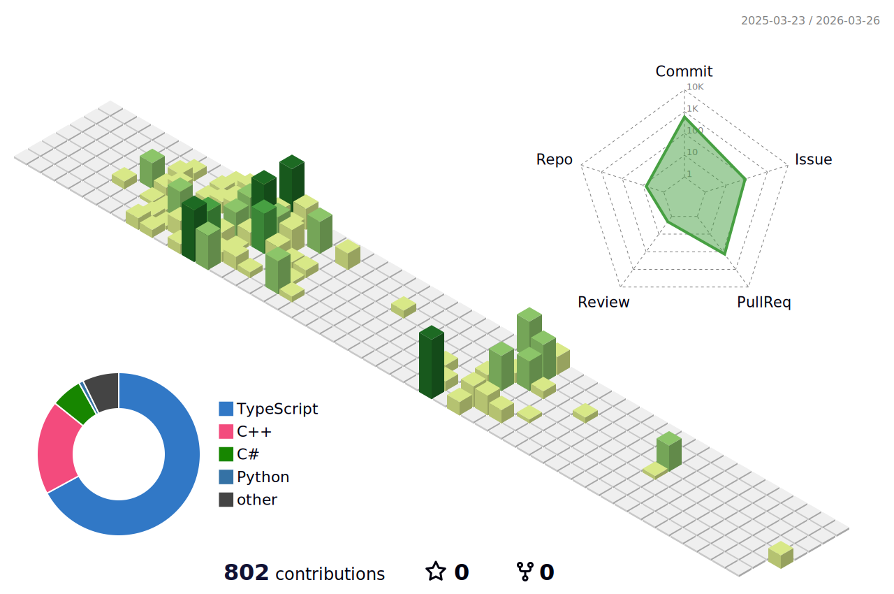

<!-- 1. GitHub usernameを変更 -->

<!-- 2. プロフィールや連絡先を変更 -->
##  プロフィール

- 🧑‍💻 北海道大学　情報科学院 修士1年
- 🌱 C++やTypeScriptを学習中
- 📫 SNS: [Twitter - @spiralneet](https://x.com/spiralneet)
 

<!-- 3. 好きな技術スタックに変更 -->
<!-- ライトモート：theme=light, ダークモート：theme=dark -->
<!-- アイコンの選択肢一覧：https://arc.net/l/quote/zizyykfh -->
## 🤏ちょこっとだけ

 

## 😠まあまあ

 

## 🏃‍♀️ Activities

 
  
  

<!--
This repository is a ✨ _special_ ✨ repository because its `README.md` (this file) appears on your GitHub profile.

Here are some ideas to get you started:

- 🔭 I’m currently working on ...
- 🌱 I’m currently learning ...
- 👯 I’m looking to collaborate on ...
- 🤔 I’m looking for help with ...
- 💬 Ask me about ...
- 📫 How to reach me: ...
- 😄 Pronouns: ...
- ⚡ Fun fact: ...
-->

